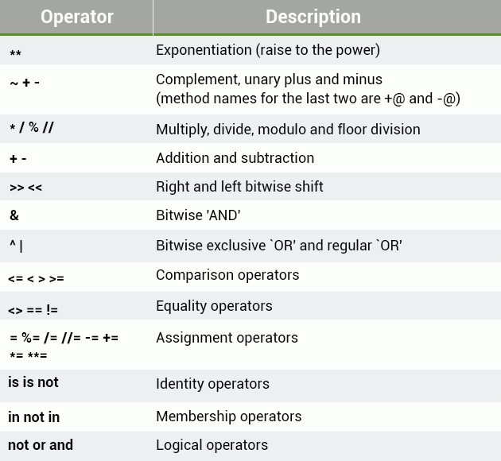

# Control Structures

- IF Statements

```python
  if expression:
     statements

  # IF STATEMENT
  num = 12
  if num > 5:
     print("Bigger than 5")
     if num <=47:
        print("Between 5 and 47")
```
- IF ELSE STATEMENT
```python
    # IF ELSE
    x = 4
    if x == 5:
      print("Yes")
    else:
      print("No")
```
- ELIF
```python
    #ELIF (Short for else if)
    num = 7
    if num == 5:
      print("Number is 5")
    elif num == 11:
      print("Number is 11")
    else:
      print("Number isn't 5, 11 or 7")
```
- Operators list



----------

- While Loop
```python
    i = 1
    while i <=5:
      print(i)
      i = i + 1
    print("Finished!")
```
- Break -  exits the loop

```python
    i = 0
    while 1==1:
    print(i)
    i = i + 1
    if i >= 5:
        print("Breaking")
        break
    print("Finished")
```

- Continue - continue jumps back to the top of the loop, rather than stopping it.
```python
    i = 0
    while True:
        i = i +1
        if i == 2:
          print("Skipping 2")
          continue
        if i == 5:
          print("Breaking")
          break
        print(i)
    print("Finished")
```

----------

## Lists

```python
  #Index starts with 0
  words = ["Hello", "world", "!"]
  empty_list = []

  #List with different data types
  number = 3
  things = ["string", 0, [1, 2, number], 4.56]
  print(things[2][2]) 
  >> 3

  # Strings are arrays
  str = "Hello world!"
  print(str[6])

  nums = [7, 7, 7, 7, 7]
  nums[2] = 5
  print(nums) >> [7,7,5,7,7]

```
- Advanced List Operations

```python

    nums = [1, 2, 3]
    print(nums + [4, 5, 6]) >> [1,2,3,4,5,6]
    print(nums * 3) >> [1,2,3,1,2,3,1,2,3]

    # Check if element in list
    words = ["spam", "egg", "spam", "sausage"]
    print("spam" in words) #True
    print("egg" in words) #True
    print("tomato" in words) #False

    #Using not
    nums = [1, 2, 3]
    print(not 4 in nums) #True
```

- List Functions

```python
  #Appending element
  nums = [1, 2, 3]
  nums.append(4)
  print(nums) # [1,2,3,4]

  #Length of array
  nums = [1, 3, 5, 2, 4]
  print(len(nums)) #5

  # Inserting at index
  words = ["Python", "fun"]
  index = 1
  words.insert(index, "is")
  print(words) #["Python","is", "fun"]

  # Index of
  letters = ['p', 'q', 'r', 's', 'p', 'u']
  print(letters.index('r')) 
  # First index of occurence
  #ValueError if not in list

```

----------

## Range

```python
  numbers = list(range(10))
  print(numbers) # [0, 1, 2, 3, 4, 5, 6, 7, 8, 9]

  #The call to list is necessary because range by itself creates a range object, and this must be converted to a list if you want to use it as one.

  numbers = list(range(3, 8))
  print(numbers) #[3, 4, 5, 6, 7]

  print(range(20) == range(0, 20)) #True

  #Third argument - Interval btw elements
  numbers = list(range(5, 20, 2))
  print(numbers) #[5, 7, 9, 11, 13, 15, 17, 19]
```


- Loops on arrays
```Python
  #While Loop

  words = ["hello", "world", "spam", "eggs"]
  counter = 0
  max_index = len(words) - 1

  while counter <= max_index:
    word = words[counter]
    print(word + "!")
    counter = counter + 1 

  #For Loop
  words = ["hello", "world", "spam", "eggs"]
  for word in words:
    print(word + "!")
  
  for i in range(5): # Print 0-5 times
    print("hello!")
```

----------
## Python Calculator

```python
  while True:
   print("Options:")
   print("Enter 'add' to add two numbers")
   print("Enter 'subtract' to subtract two numbers")
   print("Enter 'multiply' to multiply two numbers")
   print("Enter 'divide' to divide two numbers")
   print("Enter 'quit' to end the program")
   user_input = input(": ")

   if user_input == "quit":
      break
   elif user_input == "add":
      ...
   elif user_input == "subtract":
      ...
   elif user_input == "multiply":
      ...
   elif user_input == "divide":
      ...
   else:
      print("Unknown input")
```